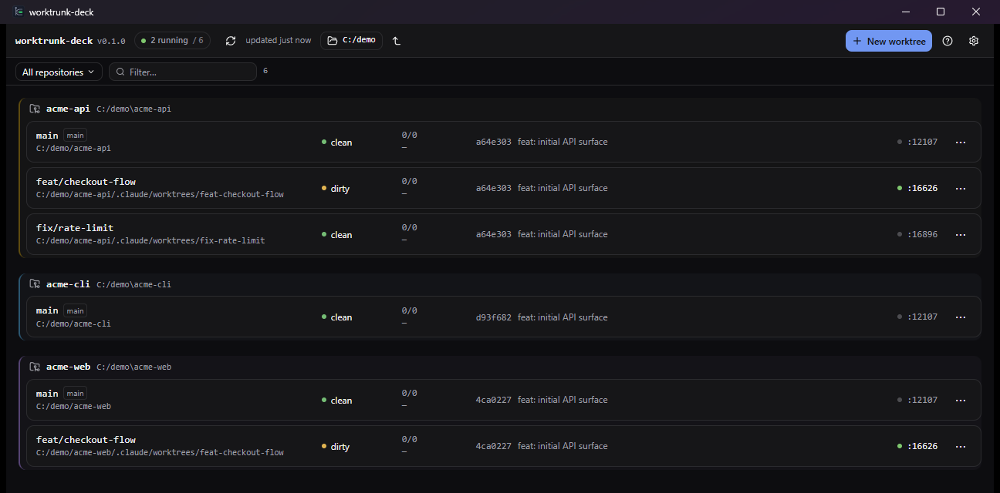

# worktrunk-deck

A cross-platform desktop dashboard for [worktrunk](https://worktrunk.dev) (`git-wt`). See every
git worktree across all your repos — which are dirty, which are ahead or behind, which dev
servers are actually running — and act on them: create, merge, remove, or drop into a real
terminal inside any worktree.

It is a thin **view and controller over `git-wt`**. worktrunk stays the single source of truth
for worktree and port state; the deck reimplements none of it.



## Status

**There are no downloadable builds yet — you install it by building from source.** That takes
about five minutes and the steps are below.

The app is feature-complete for v1 and CI builds it on Windows, macOS and Linux. What is missing
is the release side: nothing has been tagged, so there are no installers to download. When that
happens it will cover **Windows and Linux**; macOS stays build-from-source until there is a
signing certificate, for the reason in [Known gaps](#known-gaps).

## Requirements

**[worktrunk](https://worktrunk.dev) (`git-wt`) ≥ 0.60** — a hard requirement, not an optional
integration. worktrunk owns every worktree and port decision, so without it there is nothing to
show. The app detects its absence on launch and walks you through installing it, with the right
command for your platform and a re-check button.

```sh
# Windows
winget install max-sixty.worktrunk && git-wt config shell install

# macOS / Linux
brew install worktrunk && wt config shell install

# any platform with a Rust toolchain
cargo install worktrunk && wt config shell install
```

`git` must also be present, but worktrunk already requires it.

To build the app you additionally need:

- **Node ≥ 22** and [pnpm](https://pnpm.io)
- A **[Rust toolchain](https://rustup.rs)**
- Your platform's [Tauri v2 system dependencies](https://v2.tauri.app/start/prerequisites/) —
  on Debian/Ubuntu that is `libwebkit2gtk-4.1-dev`, `librsvg2-dev` and `patchelf`

> We deliberately do **not** bundle worktrunk. It is a separate project on its own release
> cadence; vendoring a copy would pin you to whatever version we shipped and would shadow the
> `git-wt` you already have configured.

## Install

```sh
git clone https://github.com/gabmichels/worktrunk-deck.git
cd worktrunk-deck
pnpm install
pnpm tauri build
```

`pnpm tauri build` writes an installer and a standalone binary to
`src-tauri/target/release/bundle/` — an `.msi`/`.exe` on Windows, a `.dmg` on macOS, a `.deb`
and `.AppImage` on Linux. Install or run whichever suits you.

To run it without installing, or to hack on it:

```sh
pnpm tauri dev
```

## First run

The app asks for two things and will not proceed until both are satisfied:

1. **`git-wt`** — found on `PATH`, or pointed at directly. GUI apps inherit a shorter `PATH`
   than your shell, especially on macOS and Linux, so if worktrunk is installed but not found,
   browse to the binary in Settings.
2. **Somewhere to look** — a folder to scan, or explicit repo paths.

Point the scan root at a folder of repositories to see them all, or at a **single repository**
to see just that repo and its worktrees. The folder button in the header switches between them
without a trip through Settings.

Configuration lives in your OS app-config directory
(`%APPDATA%\dev.worktrunk.deck\` on Windows, `~/Library/Application Support/dev.worktrunk.deck/`
on macOS, `~/.config/dev.worktrunk.deck/` on Linux). The UI writes it for you.

### Making the port column work

The **port** column and its live/idle dot come straight from worktrunk, which only assigns a
dev-server URL to a repo that asks for one. If every row shows `—`, add a `.config/wt.toml` to
that repo:

```toml
[list]
url = "http://localhost:{{ branch | hash_port }}"

[aliases]
dev = "pnpm dev --port {{ branch | hash_port }}"
```

`hash_port` derives a stable port in 10000–19999 from the branch name, so every worktree gets
its own and two worktrees on the same branch share one. The deck only *displays* this — it never
allocates ports itself.

## What it does

- **See everything.** Every worktree across every configured repo: branch, clean/dirty with
  diff counts, ahead/behind versus the default branch and the remote, HEAD, and the dev-server
  port with a live dot. Each repo gets a stable colour so they stay distinguishable.
- **Act on it.** Create a worktree, merge it back, remove it (with confirmation), open it in
  your editor or file manager, copy its path, open its dev URL.
- **Work in it.** A real PTY terminal inside any worktree — interactive, multiple concurrent
  tabs, and a "Run dev" action that starts the repo's dev command in the right directory. Every
  session is killed when the app quits, so nothing is left holding a port.
- **Dig in.** Click a card to expand its recent commits, ten at a time.
- **Filter.** By repository via a searchable multi-select, by text, or to running-only.

## Design notes

- **Only four `git-wt` subcommands** may ever be spawned — `list`, `switch`, `merge`, `remove` —
  enforced in Rust. The webview cannot spawn processes at all.
- **Exactly one call to `git` itself**, in `src-tauri/src/git.rs`: a read-only `git log` for
  commit history, which worktrunk has no subcommand for. Every flag is a fixed literal, the
  caller supplies only a path and two integers, and `--` terminates the argument list.
- **The app never runs a fix on your behalf.** When a repo fails with git's "dubious ownership"
  error, the deck shows the exact `git config --global --add safe.directory …` command with a
  copy button and offers a terminal — it does not execute it.
- **A failed refresh never blanks the view.** The last good snapshot stays on screen with a
  staleness indicator.
- **One unreadable repo never breaks the others.** It renders as an inline error card.

## Development

```sh
pnpm typecheck                 # tsc --noEmit
pnpm test                      # vitest — adapter, grouping, and helpers
cd src-tauri && cargo test     # config, git-wt allowlist, fan-out, real PTY sessions
cd src-tauri && cargo clippy --all-targets -- -D warnings
cd src-tauri && cargo fmt --check
```

All of these run in CI on Windows, macOS and Linux; run them before opening a PR.

`cargo test` really does spawn shells in real pseudo-terminals — the only way to prove ConPTY
(Windows) and `openpty` (Unix) work. Those tests take a few seconds and need no network.

**Architecture in one line:** a Rust broker (`src-tauri/src/gitwt.rs`) invokes an allowlisted set
of `git-wt` subcommands per repo in parallel, and `src/lib/adapter.ts` normalizes the raw JSON
into the types the React UI renders. No worktree or port logic lives in this app.

The `git-wt` JSON fixtures in [`test/fixtures/`](./test/fixtures/) are real, sanitized worktrunk
output; that directory's README explains how to re-capture them.

The app icon's source is [`docs/icon.svg`](./docs/icon.svg). To regenerate the platform icon set:

```sh
pnpm dlx sharp-cli -i docs/icon.svg -o docs/icon-1024.png resize 1024 1024
pnpm tauri icon docs/icon-1024.png
```

## Known gaps

- **No published releases yet.** A tag-triggered workflow is ready to publish Windows and Linux
  installers, but nothing has been tagged, so building from source is currently the only way in.
- **macOS will stay build-from-source for now.** It compiles fine — CI builds it on every push —
  but an unsigned macOS bundle fails Gatekeeper with *"worktrunk-deck is damaged and can't be
  opened"*, which reads as a corrupt download rather than a security prompt. Signing requires an
  Apple Developer Program membership (the runners handle the build, so no Mac is needed — just
  the certificate). Windows and Linux are shipped unsigned because their warnings are honest and
  dismissible.
- **Manual testing has been Windows-only.** CI builds and runs the full suite on all three
  platforms, but nobody has yet clicked through the app on macOS or Linux. The integrated
  terminal and "Run externally" are the most likely places to find problems there.
- **Cross-repo grouping uses a naive heuristic** — exact branch-name match across repos. It is
  display-only and off by default, and the heuristic is isolated in `src/lib/grouping.ts` so it
  can be replaced without touching callers.
- **`--full` is not surfaced.** The backend supports worktrunk's `--full` listing; nothing
  requests it yet.

## Contributing

Issues and pull requests welcome. Two invariants matter more than anything else:

1. **worktrunk stays the source of truth.** The deck never allocates ports, computes worktree
   paths, or runs raw `git` beyond the one read-only `log` noted above. If worktrunk cannot do
   it, neither do we.
2. **All `git-wt` knowledge lives in two files** — `src-tauri/src/gitwt.rs` (invocation) and
   `src/lib/adapter.ts` (parsing). Nothing else should know worktrunk's JSON shape.

Practical notes:

- Widening the four-subcommand allowlist is a security decision, not a refactor — raise it in an
  issue first.
- The adapter must never throw on unexpected input. `test/fixtures/list.malformed.json` exists to
  enforce that; add to it rather than loosening the test.

The full specification lives in [`specs/v1/`](./specs/v1/) — requirements and acceptance criteria
in `spec.md`, architecture and contracts in `plan.md`, and the task breakdown in `tasks.md`.

## Stack

Tauri v2 · React 19 + Vite + TypeScript · Tailwind v4 · xterm.js + `portable-pty` for the
integrated terminal. Windows, macOS, Linux.

## License

[MIT](./LICENSE)
